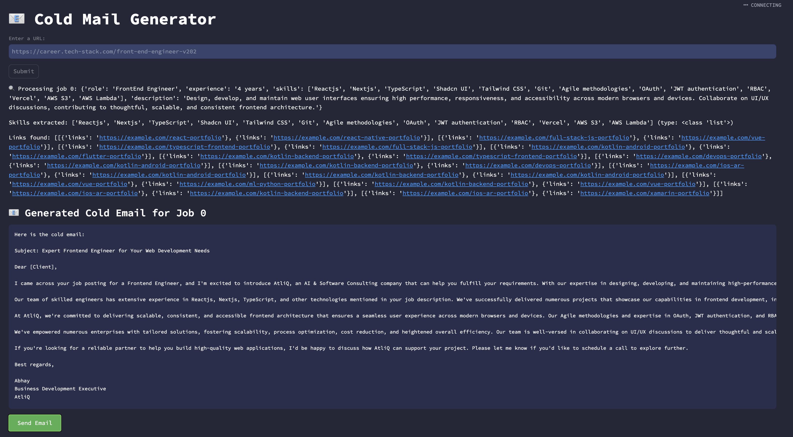

# 📧 Cold Mail Generator
Cold email generator for services company using groq, langchain and streamlit. It allows users to input the URL of a company's careers page. The tool then extracts job listings from that page and generates personalized cold emails. These emails include relevant portfolio links sourced from a vector database, based on the specific job descriptions. 

**Imagine a scenario:**

- Nike needs a Principal Software Engineer and is spending time and resources in the hiring process, on boarding, training etc
- Atliq is Software Development company can provide a dedicated software development engineer to Nike. So, the business development executive (Mohan) from Atliq is going to reach out to Nike via a cold email.



## Architecture Diagram


## Set-up
1. To get started we first need to get an API_KEY from here: https://console.groq.com/keys. Inside `app/.env` update the value of `GROQ_API_KEY` with the API_KEY you created. 


2. To get started, first install the dependencies using:
    ```
     pip install -r requirements.txt
    ```
   
3. Run the streamlit app:
   ```
   streamlit run app/main.py
   ```

## Repository Structure:
The structure of the repository is:
```
app/
├── resource/
│   ├── my_portfolio.csv
│   ├── chains.py
│   ├── main.py
│   ├── portfolio.py
│   └── utils.py
│
├── imgs/
│   ├── architecture.png
│   └── img.png
│
├── vectorstore/
│   ├── 91ca355b-d93e-43fb-b635-165...
│   │   ├── data_level0.bin
│   │   ├── header.bin
│   │   ├── length.bin
│   │   └── link_lists.bin
│   ├── 9fc860f5-8064-46f0-83d0-b75...
│   │   ├── data_level0.bin
│   │   ├── header.bin
│   │   ├── length.bin
│   │   └── link_lists.bin
│   ├── .DS_Store 
│   └── chroma.sqlite3
│
├── .DS_Store 
├── .gitignore
├── README.md
├── email_generator.ipynb
├── my_portfolio.csv
└── requirements.txt
```
